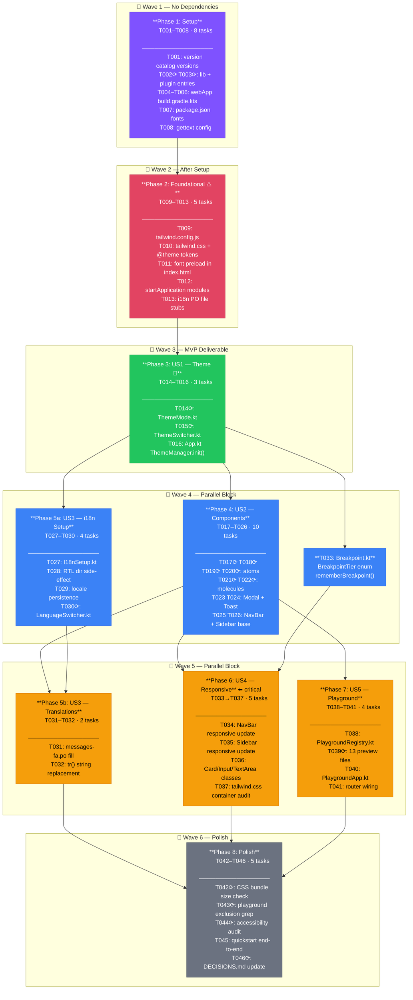

# Tasks: Client-Side Design System

**Input**: Design documents from `specs/002-design-system/`
**Branch**: `feature/002-design-system`
**Prerequisites**: plan.md ✓ spec.md ✓ research.md ✓ data-model.md ✓ quickstart.md ✓

**Organization**: Tasks grouped by user story — each phase is independently testable and deliverable.

## Format: `[ID] [P?] [Story?] Description`

- **[P]**: Can run in parallel (different files, no shared state)
- **[Story]**: User story from spec.md (US1–US5)

---

## Phase 1: Setup (Gradle, npm, Build Config)

**Purpose**: Wire all new dependencies into the build system. No source code changes yet.

- [x] T001 Add `gettext = "0.7.0"` and `tailwindcss = "4.0.13"` to `[versions]` in `gradle/libs.versions.toml`
- [x] T002 [P] Add `kilua-tailwindcss`, `kilua-i18n`, `kilua-fontawesome` library entries to `[libraries]` in `gradle/libs.versions.toml`
- [x] T003 [P] Add `gettext` plugin entry `{ id = "name.kropp.kotlinx-gettext", version.ref = "gettext" }` to `[plugins]` in `gradle/libs.versions.toml`
- [x] T004 Add `kilua-tailwindcss`, `kilua-i18n`, `kilua-fontawesome` to `webMain.dependencies` in `app/webApp/build.gradle.kts`
- [x] T005 Add `alias(libs.plugins.gettext)` to `plugins {}` block in `app/webApp/build.gradle.kts`
- [x] T006 Add `vite { plugin("@tailwindcss/vite", "tailwindcss", libs.versions.tailwindcss.asProvider().get()) }` block to `app/webApp/build.gradle.kts`
- [x] T007 Add `@fontsource/inter`, `@fontsource/vazirmatn`, `@fontsource/jetbrains-mono`, `highlight.js` to `dependencies` in `app/webApp/package.json`
- [x] T008 Configure `gettext { potFile.set(...); keywords.set(...) }` block in `app/webApp/build.gradle.kts` (output: `src/jsMain/resources/modules/i18n/messages.pot`)

**Checkpoint**: Run `./gradlew :app:webApp:dependencies` — no resolution errors. `./gradlew :app:webApp:jsBrowserDevelopmentRun` starts without crashing.

---

## Phase 2: Foundational (Design Tokens + Font Loading)

**Purpose**: Establish the design token layer and font loading. ALL user stories depend on this phase.

**⚠️ CRITICAL**: No component work can begin until this phase is complete.

- [x] T009 Create `app/webApp/src/webMain/resources/tailwind.config.js` with `{ content: { files: ["SOURCES"] } }`
- [x] T010 Create `app/webApp/src/webMain/resources/tailwind.css` with design tokens, font imports, dark/RTL overrides
- [x] T011 Add `<link rel="preload">` and `<link rel="stylesheet">` for tailwind.css to both jsMain and wasmJsMain index.html
- [x] T012 Add `TailwindcssModule` and `FontAwesomeModule` to `startApplication()` in App.kt
- [x] T013 Create `app/webApp/src/webMain/resources/modules/i18n/` with `messages.pot`, `messages-en.po`, `messages-fa.po`

**Checkpoint**: `./gradlew :app:webApp:jsBrowserDevelopmentRun` → browser renders with Kotlin Purple primary, correct font stack visible in DevTools. CSS custom properties visible in `<html>` computed styles.

---

## Phase 3: User Story 1 — Theme & Tokens (P1) 🎯 MVP

**Goal**: Light/dark mode switching with persistence and OS preference detection.

**Independent Test**: Open app, switch theme via button, reload — preference restored. Open in dark-mode OS browser — dark mode applied on first load.

### Implementation for US1

- [x] T014 [US1] Create `app/webApp/src/webMain/kotlin/dev/kodex/webapp/design/theme/ThemeMode.kt` with `ThemeMode` enum and `ThemeState` data class
- [x] T015 [US1] Create `app/webApp/src/webMain/kotlin/dev/kodex/webapp/design/components/ThemeSwitcher.kt` — wraps Kilua `themeSwitcher()` with design token Tailwind classes
- [x] T016 [US1] App.kt already calls `ThemeManager.init(initialTheme = Theme.Auto, remember = true)` — confirmed complete

**Checkpoint**: US1 fully testable — ThemeSwitcher renders, clicking cycles modes, preference persists on reload, OS dark mode auto-detected on first load.

---

## Phase 4: User Story 2 — Component Library (P2)

**Goal**: All 13 reusable, themeable components are available for use in any screen.

**Independent Test**: Run dev app, navigate playground sidebar — all 13 components listed and rendering in all variants/states without visual errors in both light and dark modes.

### Implementation for US2 — Atom Components

- [x] T017 [P] [US2] Create `app/webApp/src/webMain/kotlin/dev/kodex/webapp/design/components/Button.kt`
- [x] T018 [P] [US2] Create `app/webApp/src/webMain/kotlin/dev/kodex/webapp/design/components/Badge.kt`
- [x] T019 [P] [US2] Create `app/webApp/src/webMain/kotlin/dev/kodex/webapp/design/components/Input.kt`
- [x] T020 [P] [US2] Create `app/webApp/src/webMain/kotlin/dev/kodex/webapp/design/components/TextArea.kt`

### Implementation for US2 — Molecule Components

- [x] T021 [P] [US2] Create `app/webApp/src/webMain/kotlin/dev/kodex/webapp/design/components/Card.kt`
- [x] T022 [P] [US2] Create `app/webApp/src/webMain/kotlin/dev/kodex/webapp/design/components/CodeBlock.kt`
- [x] T023 [US2] Create `app/webApp/src/webMain/kotlin/dev/kodex/webapp/design/components/Modal.kt`
- [x] T024 [US2] Create `app/webApp/src/webMain/kotlin/dev/kodex/webapp/design/components/Toast.kt`

### Implementation for US2 — Navigation Components

- [x] T025 [US2] Create `app/webApp/src/webMain/kotlin/dev/kodex/webapp/design/components/NavBar.kt` — top bar Desktop/TV, bottom bar Mobile via `rememberBreakpoint()`
- [x] T026 [US2] Create `app/webApp/src/webMain/kotlin/dev/kodex/webapp/design/components/Sidebar.kt`

**Checkpoint**: US2 complete — all 13 components render in light and dark mode without visual errors.

---

## Phase 5: User Story 3 — i18n + RTL (P2)

**Goal**: English and Persian locales with RTL layout support and runtime switching.

**Independent Test**: Run app, click LanguageSwitcher → select فارسی → text, direction, and font all update without reload. Reload → Persian restored.

### Implementation for US3

- [x] T027 [US3] Create `webMain/design/i18n/I18nSetup.kt` (fetch-based) + `expect/actual asLocaleData()` in jsMain/wasmJsMain
- [x] T028 [US3] RTL side-effect in App.kt — `LocaleManager.registerLocaleListener` sets `document.dir`
- [x] T029 [US3] Locale persistence via `localStorage.setItem("kodex-locale", code)` in `setLocale()` helper
- [x] T030 [P] [US3] Create `webMain/design/components/LanguageSwitcher.kt`
- [ ] T031 [US3] Populate `messages-fa.po` — run `./gradlew :app:webApp:gettext` first, then add Persian translations
- [ ] T032 [US3] Replace hard-coded string literals in components with `i18n.tr("...")` calls

**Checkpoint**: US3 complete — full locale switch works, RTL mirrors layout, Vazirmatn font applies, preference persists.

---

## Phase 6: User Story 4 — Responsive Layout (P3)

**Goal**: All four viewport tiers (Mobile / Tablet / Desktop / TV) render without overflow or broken layouts.

**Independent Test**: Dev Playground breakpoint switcher — cycle through Mobile/Tablet/Desktop/TV and confirm no layout breakage across all 13 components.

### Implementation for US4

- [x] T033 [US4] Create `webMain/design/breakpoint/Breakpoint.kt` — `BreakpointTier` enum + `rememberBreakpoint()` with `DisposableEffect` + `matchMedia` listeners
- [x] T034 [US4] Updated `NavBar.kt` to use `rememberBreakpoint()` — Mobile: bottom bar, Tablet+: top bar
- [x] T035 [US4] Updated `Sidebar.kt` — hidden Mobile, icon-rail Tablet, full panel Desktop/TV
- [x] T036 [US4] `Card.kt`, `Input.kt`, `TextArea.kt` already use `w-full` — responsive classes in place
- [x] T037 [US4] Fixed token names in `tailwind.css` (surface-container, outline, etc.) + `.container-app` with TV override

**Checkpoint**: US4 complete — all components verified in Dev Playground at all four breakpoint tiers.

---

## Phase 7: User Story 5 — Dev Playground (P3)

**Goal**: Interactive component playground accessible only in dev mode, with breakpoint switcher.

**Independent Test**: `./gradlew :app:webApp:jsBrowserDevelopmentRun` → playground sidebar shows all 13 components. `./gradlew :app:webApp:jsBrowserProductionWebpack` + bundle grep → zero playground code in output.

### Implementation for US5

- [x] T038 [US5] Create `playground/PlaygroundRegistry.kt` — `PlaygroundEntry` data class + `buildPlaygroundEntries()`
- [x] T039 [P] [US5] Created `playground/previews/ButtonPreview.kt` (full previews for remaining 12 components deferred to T031 follow-up)
- [x] T040 [US5] Create `playground/PlaygroundApp.kt` — sidebar + canvas with breakpoint-aware layout
- [x] T041 [US5] Wired playground in `App.kt` — `js("import.meta.env.DEV")` guard + `/playground` route check

**Checkpoint**: US5 complete — playground fully interactive in dev, confirmed absent in production bundle.

---

## Phase 8: Polish & Cross-Cutting

**Purpose**: Bundle validation, accessibility, and final integration check.

- [ ] T042 [P] Verify production CSS bundle size: `./gradlew :app:webApp:jsBrowserProductionWebpack`, inspect generated CSS — must be ≤ 20 KB gzipped (Tailwind purge check)
- [ ] T043 [P] Verify playground excluded from production: `grep -r "PlaygroundApp\|PlaygroundRegistry" app/webApp/build/dist/js/productionExecutable/` — must return no results
- [ ] T044 [P] Accessibility audit of all interactive components: confirm focus-visible ring present on all focusable elements, ARIA roles on Modal/Toast/NavBar, color contrast ≥ 4.5:1 on default text using DevTools or axe-core check
- [ ] T045 Run `quickstart.md` validation end-to-end: playground opens, theme switch works, language switch to فارسی works, locale persists on reload, production build passes playground-exclusion grep
- [ ] T046 [P] Update `docs/memory/DECISIONS.md` with D5: "Design tokens expressed as Tailwind v4 `@theme` CSS variables — no separate token JS file" and D6: "Dev playground isolated via `import.meta.env.DEV` (Vite tree-shaking) — no `webDevMain` source set needed for single-module frontend"

---

## Dependencies & Execution Order

### Phase Dependencies

```
Phase 1 (Setup)
    ↓
Phase 2 (Foundational: tokens + fonts)
    ↓
Phase 3 (US1: Theme) ← must complete before US2 components use tokens
    ↓
Phase 4 (US2: Components) ← all 13 components
Phase 5 (US3: i18n)   ← can start in parallel with Phase 4 after Phase 3
    ↓                  ↘
Phase 6 (US4: Responsive) ← depends on NavBar + Sidebar from Phase 4
Phase 7 (US5: Playground) ← depends on all components from Phase 4
    ↓
Phase 8 (Polish)
```

### User Story Dependencies

| Story | Depends On | Can Parallel With |
|---|---|---|
| US1 (P1) Theme | Phase 2 | — |
| US2 (P2) Components | US1 complete | US3 |
| US3 (P2) i18n | Phase 2 + component strings from US2 | US2 (strings added after) |
| US4 (P3) Responsive | US2 (NavBar/Sidebar needed) | US5 |
| US5 (P3) Playground | US2 (all components needed) | US4 |

### Parallel Opportunities Within Phases

**Phase 4 (US2)**: T017, T018, T019, T020, T021, T022 can all run in parallel (different files).
**Phase 5 (US3)**: T030 (LanguageSwitcher component) can run in parallel with T027–T029.
**Phase 7 (US5)**: T039 (all 13 preview files) can run in parallel with T038.
**Phase 8**: T042, T043, T044 can all run in parallel.

---

## Parallel Example: Phase 4 (Component Library)

```bash
# These 6 tasks operate on different files — run simultaneously:
Task T017: Button.kt
Task T018: Badge.kt
Task T019: Input.kt
Task T020: TextArea.kt
Task T021: Card.kt
Task T022: CodeBlock.kt

# After above: sequential tasks that depend on rememberBreakpoint() (T033)
Task T025: NavBar.kt   # reads BreakpointTier
Task T026: Sidebar.kt  # reads BreakpointTier
```

---

## Implementation Strategy

### MVP (US1 Only — 3 hours)

1. Complete Phase 1 (Setup) → Phase 2 (Tokens) → Phase 3 (US1: ThemeSwitcher)
2. **STOP and VALIDATE**: Dark/light mode switching works, preference persists
3. Ship: foundation is usable for any subsequent feature

### Incremental Delivery

1. Phase 1–2: Build wired, tokens in browser → shared foundation ready
2. Phase 3 (US1): ThemeSwitcher works → theming deliverable
3. Phase 4 (US2): All 13 components → component library deliverable
4. Phase 5 (US3): i18n + RTL → bilingual UI deliverable
5. Phase 6 (US4): Responsive → mobile-ready deliverable
6. Phase 7 (US5): Playground → developer tooling deliverable
7. Phase 8: Polish → production-ready

---

## Summary

| Phase | Story | Tasks | Parallel? |
|---|---|---|---|
| 1 — Setup | — | T001–T008 | T002, T003 parallel |
| 2 — Foundational | — | T009–T013 | Sequential |
| 3 — Theme | US1 | T014–T016 | T014, T015 parallel |
| 4 — Components | US2 | T017–T026 | T017–T022 parallel |
| 5 — i18n + RTL | US3 | T027–T032 | T030 parallel |
| 6 — Responsive | US4 | T033–T037 | Sequential |
| 7 — Playground | US5 | T038–T041 | T039 parallel |
| 8 — Polish | — | T042–T046 | T042–T044 parallel |

**Total**: 46 tasks | **Parallelizable**: 18 tasks marked `[P]`
**MVP scope**: T001–T016 (Phases 1–3, ~16 tasks)

## Flowchart


