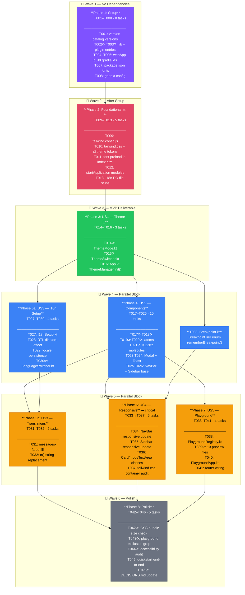

# Tasks: Client-Side Design System

**Input**: Design documents from `specs/002-design-system/`
**Branch**: `feature/002-design-system`
**Prerequisites**: plan.md ✓ spec.md ✓ research.md ✓ data-model.md ✓ quickstart.md ✓

**Organization**: Tasks grouped by user story — each phase is independently testable and deliverable.

## Format: `[ID] [P?] [Story?] Description`

- **[P]**: Can run in parallel (different files, no shared state)
- **[Story]**: User story from spec.md (US1–US5)

---

## Phase 1: Setup (Gradle, npm, Build Config)

**Purpose**: Wire all new dependencies into the build system. No source code changes yet.

- [x] T001 Add `gettext = "0.7.0"` and `tailwindcss = "4.0.13"` to `[versions]` in `gradle/libs.versions.toml`
- [x] T002 [P] Add `kilua-tailwindcss`, `kilua-i18n`, `kilua-fontawesome` library entries to `[libraries]` in `gradle/libs.versions.toml`
- [x] T003 [P] Add `gettext` plugin entry `{ id = "name.kropp.kotlinx-gettext", version.ref = "gettext" }` to `[plugins]` in `gradle/libs.versions.toml`
- [x] T004 Add `kilua-tailwindcss`, `kilua-i18n`, `kilua-fontawesome` to `webMain.dependencies` in `app/webApp/build.gradle.kts`
- [x] T005 Add `alias(libs.plugins.gettext)` to `plugins {}` block in `app/webApp/build.gradle.kts`
- [x] T006 Add `vite { plugin("@tailwindcss/vite", "tailwindcss", libs.versions.tailwindcss.asProvider().get()) }` block to `app/webApp/build.gradle.kts`
- [x] T007 Add `@fontsource/inter`, `@fontsource/vazirmatn`, `@fontsource/jetbrains-mono`, `highlight.js` to `dependencies` in `app/webApp/package.json`
- [x] T008 Configure `gettext { potFile.set(...); keywords.set(...) }` block in `app/webApp/build.gradle.kts` (output: `src/jsMain/resources/modules/i18n/messages.pot`)

**Checkpoint**: Run `./gradlew :app:webApp:dependencies` — no resolution errors. `./gradlew :app:webApp:jsBrowserDevelopmentRun` starts without crashing.

---

## Phase 2: Foundational (Design Tokens + Font Loading)

**Purpose**: Establish the design token layer and font loading. ALL user stories depend on this phase.

**⚠️ CRITICAL**: No component work can begin until this phase is complete.

- [ ] T009 Create `app/webApp/src/commonMain/resources/tailwind.config.js` with `{ content: { files: ["SOURCES"] } }`
- [ ] T010 Create `app/webApp/src/commonMain/resources/tailwind.css` with: `@config "./tailwind.config.js"`, `@import "tailwindcss"`, font `@import` statements for Inter/Vazirmatn/JetBrains Mono, `@custom-variant dark (&:where(.dark, .dark *))`, full `@theme { }` block with all color/typography/spacing/radius/shadow tokens from data-model.md, `.dark { }` overrides, and `[dir=rtl] { --font-sans: "Vazirmatn", sans-serif; }` override
- [ ] T011 Add `<link rel="preload">` tags for variable font files to `app/webApp/src/commonMain/resources/index.html` (Inter, Vazirmatn, JetBrains Mono)
- [ ] T012 Add `TailwindcssModule` and `FontAwesomeModule` to `startApplication()` in `app/webApp/src/webMain/kotlin/dev/kodex/webapp/Main.kt`
- [ ] T013 Create `app/webApp/src/commonMain/resources/modules/i18n/` directory with empty `messages.pot`, `messages-en.po`, and `messages-fa.po` files (proper PO headers; Persian plural form header in `messages-fa.po`)

**Checkpoint**: `./gradlew :app:webApp:jsBrowserDevelopmentRun` → browser renders with Kotlin Purple primary, correct font stack visible in DevTools. CSS custom properties visible in `<html>` computed styles.

---

## Phase 3: User Story 1 — Theme & Tokens (P1) 🎯 MVP

**Goal**: Light/dark mode switching with persistence and OS preference detection.

**Independent Test**: Open app, switch theme via button, reload — preference restored. Open in dark-mode OS browser — dark mode applied on first load.

### Implementation for US1

- [ ] T014 [US1] Create `app/webApp/src/commonMain/kotlin/dev/kodex/webapp/design/theme/ThemeMode.kt` with `ThemeMode` enum (`Light`, `Dark`, `Auto`) and `ThemeState` data class
- [ ] T015 [US1] Create `app/webApp/src/commonMain/kotlin/dev/kodex/webapp/design/components/ThemeSwitcher.kt` — Kilua `@Composable` function wrapping Kilua's built-in `themeSwitcher()` with `round = true` and Tailwind classes matching the design token palette
- [ ] T016 [US1] Update `app/webApp/src/commonMain/kotlin/dev/kodex/webapp/App.kt`: call `ThemeManager.init(initialTheme = Theme.Auto, remember = true)` in `Application.start()`; expose `ThemeManager.theme` as app-level state

**Checkpoint**: US1 fully testable — ThemeSwitcher renders, clicking cycles modes, preference persists on reload, OS dark mode auto-detected on first load.

---

## Phase 4: User Story 2 — Component Library (P2)

**Goal**: All 13 reusable, themeable components are available for use in any screen.

**Independent Test**: Run dev app, navigate playground sidebar — all 13 components listed and rendering in all variants/states without visual errors in both light and dark modes.

### Implementation for US2 — Atom Components

- [ ] T017 [P] [US2] Create `app/webApp/src/commonMain/kotlin/dev/kodex/webapp/design/components/Button.kt` — `ButtonVariant` enum, `ComponentSize` enum, `@Composable fun Button(variant, size, onClick, enabled, content)` with all Tailwind variant classes and hover/focus/disabled states
- [ ] T018 [P] [US2] Create `app/webApp/src/commonMain/kotlin/dev/kodex/webapp/design/components/Badge.kt` — `BadgeVariant` enum, `@Composable fun Badge(variant, content)` with color-mapped Tailwind classes per variant
- [ ] T019 [P] [US2] Create `app/webApp/src/commonMain/kotlin/dev/kodex/webapp/design/components/Input.kt` — `InputType` enum, `@Composable fun Input(type, value, onValueChange, label, helperText, error, placeholder)` with error/focus/disabled states
- [ ] T020 [P] [US2] Create `app/webApp/src/commonMain/kotlin/dev/kodex/webapp/design/components/TextArea.kt` — `@Composable fun TextArea(value, onValueChange, label, helperText, error, maxLength, showCounter)` with auto-resize via `oninput` + `style.height = "auto"` guard

### Implementation for US2 — Molecule Components

- [ ] T021 [P] [US2] Create `app/webApp/src/commonMain/kotlin/dev/kodex/webapp/design/components/Card.kt` — `@Composable fun Card(header, footer, onClick, selected, content)` with optional sections and clickable variant
- [ ] T022 [P] [US2] Create `app/webApp/src/commonMain/kotlin/dev/kodex/webapp/design/components/CodeBlock.kt` — `@Composable fun CodeBlock(code, language, showCopyButton)` with `font-mono` class, horizontal scroll, copy-to-clipboard via `navigator.clipboard.writeText`, Highlight.js CSS theme applied via class
- [ ] T023 [US2] Create `app/webApp/src/commonMain/kotlin/dev/kodex/webapp/design/components/Modal.kt` — `@Composable fun Modal(visible, onDismiss, title, content)` with focus trap (`tabIndex`, focus management on open/close), backdrop click dismiss, Escape key handler, z-index layer via Tailwind
- [ ] T024 [US2] Create `app/webApp/src/commonMain/kotlin/dev/kodex/webapp/design/components/Toast.kt` — `ToastMessage` data class, `ToastStore` (app-scoped `mutableStateListOf`), `@Composable fun ToastContainer()` that renders stacked toasts with auto-dismiss timer (`kotlinx.coroutines.delay`) and manual dismiss button

### Implementation for US2 — Navigation Components

- [ ] T025 [US2] Create `app/webApp/src/commonMain/kotlin/dev/kodex/webapp/design/components/NavBar.kt` — `@Composable fun NavBar(items, selectedItem, onItemSelect, actions)` — renders as `<nav>` with top bar on Desktop/TV, bottom bar on Mobile (reads `rememberBreakpoint()`)
- [ ] T026 [US2] Create `app/webApp/src/commonMain/kotlin/dev/kodex/webapp/design/components/Sidebar.kt` — `@Composable fun Sidebar(items, selectedItem, onItemSelect, collapsed, onToggle)` — icon rail on Tablet, hidden on Mobile, full nav on Desktop/TV

**Checkpoint**: US2 complete — all 13 components render in light and dark mode without visual errors.

---

## Phase 5: User Story 3 — i18n + RTL (P2)

**Goal**: English and Persian locales with RTL layout support and runtime switching.

**Independent Test**: Run app, click LanguageSwitcher → select فارسی → text, direction, and font all update without reload. Reload → Persian restored.

### Implementation for US3

- [ ] T027 [US3] Add `@JsModule` external declarations for `messages-en.po` and `messages-fa.po` and construct `val i18n = I18n("en" to messagesEn, "fa" to messagesFa)` in new `app/webApp/src/commonMain/kotlin/dev/kodex/webapp/design/i18n/I18nSetup.kt`
- [ ] T028 [US3] Add RTL side-effect in `app/webApp/src/webMain/kotlin/dev/kodex/webapp/App.kt`: collect `LocaleManager.currentLocale` as `State`, set `document.documentElement?.dir` to `"rtl"` for `fa` and `"ltr"` for `en`, guarded by `if (renderConfig.isDom)` (webMain only)
- [ ] T029 [US3] Add locale persistence on change: call `LocaleManager.setCurrentLocale(SimpleLocale(code))` in LanguageSwitcher; Kilua's `LocaleManager` already persists to LocalStorage — verify or add manual fallback
- [ ] T030 [P] [US3] Create `app/webApp/src/commonMain/kotlin/dev/kodex/webapp/design/components/LanguageSwitcher.kt` — `@Composable fun LanguageSwitcher(i18n)` renders dropdown/button pair for `en`/`fa`, calls `LocaleManager.setCurrentLocale()`, displays native locale name (`English` / `فارسی`)
- [ ] T031 [US3] Populate `app/webApp/src/commonMain/resources/modules/i18n/messages-fa.po`: translate all UI strings for all 13 component labels, NavBar items, and playground titles. Run `./gradlew :app:webApp:gettext` first to generate `messages.pot`, then fill Persian translations.
- [ ] T032 [US3] Replace all hard-coded string literals in components (Button labels, Input placeholders, Toast messages, NavBar titles) with `i18n.tr("...")` calls so they participate in locale switching

**Checkpoint**: US3 complete — full locale switch works, RTL mirrors layout, Vazirmatn font applies, preference persists.

---

## Phase 6: User Story 4 — Responsive Layout (P3)

**Goal**: All four viewport tiers (Mobile / Tablet / Desktop / TV) render without overflow or broken layouts.

**Independent Test**: Dev Playground breakpoint switcher — cycle through Mobile/Tablet/Desktop/TV and confirm no layout breakage across all 13 components.

### Implementation for US4

- [ ] T033 [US4] Create `app/webApp/src/commonMain/kotlin/dev/kodex/webapp/design/breakpoint/Breakpoint.kt` — `BreakpointTier` enum (`Mobile, Tablet, Desktop, Tv`) and `@Composable fun rememberBreakpoint(): State<BreakpointTier>` using `window.matchMedia` in `webMain` with `DisposableEffect` for listener cleanup
- [ ] T034 [US4] Update `NavBar.kt` to consume `rememberBreakpoint()`: bottom nav layout (`fixed bottom-0 flex-row`) for `Mobile`, top bar for `Tablet`/`Desktop`/`Tv`; ensure RTL-aware padding with `ps-`/`pe-` logical properties
- [ ] T035 [US4] Update `Sidebar.kt` to consume `rememberBreakpoint()`: hidden on `Mobile`, icon-only rail (`w-16`) on `Tablet`, full panel (`w-64`) on `Desktop`/`Tv`; collapse toggle only visible on `Tablet`
- [ ] T036 [US4] Add responsive Tailwind classes to `Card.kt`, `Input.kt`, `TextArea.kt`: full-width (`w-full`) on Mobile, constrained widths on larger tiers using `sm:`, `lg:`, `2xl:` prefixes
- [ ] T037 [US4] Audit and update `tailwind.css`: add `max-w-screen-2xl mx-auto` container class, verify all `clamp()` typography tokens render correctly at 320 px (Mobile) and 2560 px (TV) viewport widths

**Checkpoint**: US4 complete — all components verified in Dev Playground at all four breakpoint tiers.

---

## Phase 7: User Story 5 — Dev Playground (P3)

**Goal**: Interactive component playground accessible only in dev mode, with breakpoint switcher.

**Independent Test**: `./gradlew :app:webApp:jsBrowserDevelopmentRun` → playground sidebar shows all 13 components. `./gradlew :app:webApp:jsBrowserProductionWebpack` + bundle grep → zero playground code in output.

### Implementation for US5

- [ ] T038 [US5] Create `app/webApp/src/webMain/kotlin/dev/kodex/webapp/playground/PlaygroundRegistry.kt` — `PlaygroundEntry` data class and `buildPlaygroundEntries(): List<PlaygroundEntry>` function returning entries for all 13 components; entire file wrapped in `if (js("import.meta.env.DEV").unsafeCast<Boolean>())` guard
- [ ] T039 [P] [US5] Create preview composables in `app/webApp/src/webMain/kotlin/dev/kodex/webapp/playground/previews/` — one `*Preview.kt` file per component (13 files), each rendering all variants and sizes side-by-side with Tailwind `grid gap-4`
- [ ] T040 [US5] Create `app/webApp/src/webMain/kotlin/dev/kodex/webapp/playground/PlaygroundApp.kt` — `@Composable fun PlaygroundApp()` with left sidebar listing component names from `PlaygroundRegistry`, main canvas showing selected component preview, and breakpoint switcher (`BreakpointTier` state controlling `max-w-*` of canvas container)
- [ ] T041 [US5] Wire playground into router in `app/webApp/src/webMain/kotlin/dev/kodex/webapp/App.kt`: conditionally add `/playground` route calling `PlaygroundApp()` only when `import.meta.env.DEV` is true

**Checkpoint**: US5 complete — playground fully interactive in dev, confirmed absent in production bundle.

---

## Phase 8: Polish & Cross-Cutting

**Purpose**: Bundle validation, accessibility, and final integration check.

- [ ] T042 [P] Verify production CSS bundle size: `./gradlew :app:webApp:jsBrowserProductionWebpack`, inspect generated CSS — must be ≤ 20 KB gzipped (Tailwind purge check)
- [ ] T043 [P] Verify playground excluded from production: `grep -r "PlaygroundApp\|PlaygroundRegistry" app/webApp/build/dist/js/productionExecutable/` — must return no results
- [ ] T044 [P] Accessibility audit of all interactive components: confirm focus-visible ring present on all focusable elements, ARIA roles on Modal/Toast/NavBar, color contrast ≥ 4.5:1 on default text using DevTools or axe-core check
- [ ] T045 Run `quickstart.md` validation end-to-end: playground opens, theme switch works, language switch to فارسی works, locale persists on reload, production build passes playground-exclusion grep
- [ ] T046 [P] Update `docs/memory/DECISIONS.md` with D5: "Design tokens expressed as Tailwind v4 `@theme` CSS variables — no separate token JS file" and D6: "Dev playground isolated via `import.meta.env.DEV` (Vite tree-shaking) — no `webDevMain` source set needed for single-module frontend"

---

## Dependencies & Execution Order

### Phase Dependencies

```
Phase 1 (Setup)
    ↓
Phase 2 (Foundational: tokens + fonts)
    ↓
Phase 3 (US1: Theme) ← must complete before US2 components use tokens
    ↓
Phase 4 (US2: Components) ← all 13 components
Phase 5 (US3: i18n)   ← can start in parallel with Phase 4 after Phase 3
    ↓                  ↘
Phase 6 (US4: Responsive) ← depends on NavBar + Sidebar from Phase 4
Phase 7 (US5: Playground) ← depends on all components from Phase 4
    ↓
Phase 8 (Polish)
```

### User Story Dependencies

| Story | Depends On | Can Parallel With |
|---|---|---|
| US1 (P1) Theme | Phase 2 | — |
| US2 (P2) Components | US1 complete | US3 |
| US3 (P2) i18n | Phase 2 + component strings from US2 | US2 (strings added after) |
| US4 (P3) Responsive | US2 (NavBar/Sidebar needed) | US5 |
| US5 (P3) Playground | US2 (all components needed) | US4 |

### Parallel Opportunities Within Phases

**Phase 4 (US2)**: T017, T018, T019, T020, T021, T022 can all run in parallel (different files).
**Phase 5 (US3)**: T030 (LanguageSwitcher component) can run in parallel with T027–T029.
**Phase 7 (US5)**: T039 (all 13 preview files) can run in parallel with T038.
**Phase 8**: T042, T043, T044 can all run in parallel.

---

## Parallel Example: Phase 4 (Component Library)

```bash
# These 6 tasks operate on different files — run simultaneously:
Task T017: Button.kt
Task T018: Badge.kt
Task T019: Input.kt
Task T020: TextArea.kt
Task T021: Card.kt
Task T022: CodeBlock.kt

# After above: sequential tasks that depend on rememberBreakpoint() (T033)
Task T025: NavBar.kt   # reads BreakpointTier
Task T026: Sidebar.kt  # reads BreakpointTier
```

---

## Implementation Strategy

### MVP (US1 Only — 3 hours)

1. Complete Phase 1 (Setup) → Phase 2 (Tokens) → Phase 3 (US1: ThemeSwitcher)
2. **STOP and VALIDATE**: Dark/light mode switching works, preference persists
3. Ship: foundation is usable for any subsequent feature

### Incremental Delivery

1. Phase 1–2: Build wired, tokens in browser → shared foundation ready
2. Phase 3 (US1): ThemeSwitcher works → theming deliverable
3. Phase 4 (US2): All 13 components → component library deliverable
4. Phase 5 (US3): i18n + RTL → bilingual UI deliverable
5. Phase 6 (US4): Responsive → mobile-ready deliverable
6. Phase 7 (US5): Playground → developer tooling deliverable
7. Phase 8: Polish → production-ready

---

## Summary

| Phase | Story | Tasks | Parallel? |
|---|---|---|---|
| 1 — Setup | — | T001–T008 | T002, T003 parallel |
| 2 — Foundational | — | T009–T013 | Sequential |
| 3 — Theme | US1 | T014–T016 | T014, T015 parallel |
| 4 — Components | US2 | T017–T026 | T017–T022 parallel |
| 5 — i18n + RTL | US3 | T027–T032 | T030 parallel |
| 6 — Responsive | US4 | T033–T037 | Sequential |
| 7 — Playground | US5 | T038–T041 | T039 parallel |
| 8 — Polish | — | T042–T046 | T042–T044 parallel |

**Total**: 46 tasks | **Parallelizable**: 18 tasks marked `[P]`
**MVP scope**: T001–T016 (Phases 1–3, ~16 tasks)

## Flowchart


