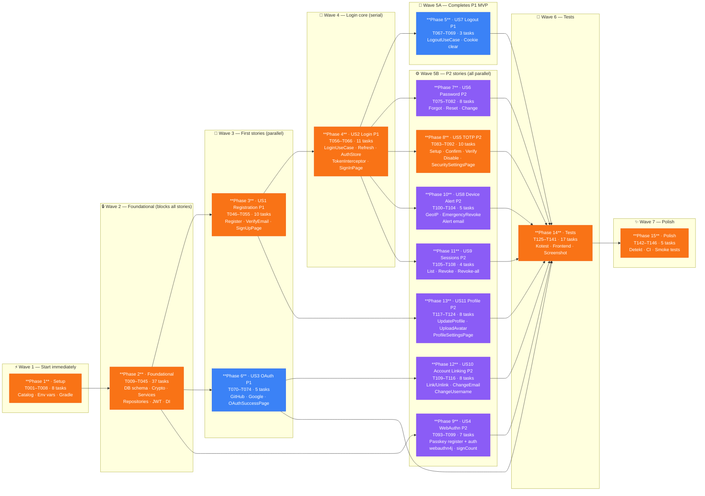

# Task Dependency Graph: Authentication & User Identity (Spec 004)

**Source**: `specs/004-auth/tasks.md` | **Total tasks**: 146 | **Generated**: 2026-06-09

---

## Dependency DAG (Phase-Level)

Each node = one phase. Edges show blocking dependencies. Grouped by execution wave.



---

## Legend

| Color | Meaning |
|-------|---------|
| 🟠 Orange | **Critical path** — longest dependency chain |
| 🔵 Blue | **P1 story** — part of MVP scope |
| 🟣 Purple | **P2 story** — ships after MVP |

---

## Critical Path

**Longest chain** (determines minimum completion time):

```
Phase 1 (8) → Phase 2 (37) → Phase 3 US1 (10) → Phase 4 US2 (11) → Phase 8 TOTP (10) → Phase 14 Tests (17) → Phase 15 Polish (5)
```

**Total on critical path**: 98 tasks out of 146

**Why Phase 8 TOTP is on the critical path**: TOTP is the longest P2 story (10 tasks) AND directly modifies the login flow (US2) — making Phase 14 tests depend on it being stable first.

---

## Execution Waves Summary

| Wave | Phases | Tasks | Can start | Notes |
|------|--------|-------|-----------|-------|
| W1 | Phase 1 | 8 | ✅ Immediately | No dependencies |
| W2 | Phase 2 | 37 | After W1 | All stories blocked until here |
| W3 | Phase 3, Phase 6 | 15 | After W2 | **Parallel** — US1 + US3 independent |
| W4 | Phase 4 | 11 | After Phase 3 | Login needs registered users |
| W5A | Phase 5 | 3 | After Phase 4 | Completes P1 MVP (all P1 stories done) |
| W5B | Phases 7–13 | 50 | After Phase 4/3/6 | **All 7 parallel** — P2 max parallelism |
| W6 | Phase 14 | 17 | After all stories | Tests cover all 11 stories |
| W7 | Phase 15 | 5 | After W6 | Detekt + CI + smoke |

**Total waves**: 7 | **Max parallel at W5B**: 7 stories simultaneously

---

## MVP Cutoff

To ship a minimal working auth system (register + login + logout):

```
Phase 1 → Phase 2 → Phase 3 (US1) → Phase 4 (US2) → Phase 5 (US7)
8 + 37 + 10 + 11 + 3 = 69 tasks (47% of total)
```

MVP delivers: email registration, email verification, email/password login, JWT access token, refresh token rotation, logout.

---

## Parallel Execution Examples

### Maximum Parallelism Point (Wave 5B)

All 7 P2 stories can execute simultaneously once Phase 4 (Login) is complete:

```bash
# Can all run in parallel after Phase 4 done:
[Thread 1] Phase 7  — US6 Forgot/Change Password   (T075–T082)
[Thread 2] Phase 8  — US5 TOTP 2FA                 (T083–T092)
[Thread 3] Phase 9  — US4 WebAuthn Passkeys         (T093–T099)
[Thread 4] Phase 10 — US8 New Device Alert          (T100–T104)
[Thread 5] Phase 11 — US9 Active Sessions           (T105–T108)
[Thread 6] Phase 12 — US10 Account Linking          (T109–T116)  ← needs Phase 6 (OAuth)
[Thread 7] Phase 13 — US11 Profile Edit             (T117–T124)  ← needs Phase 3 (US1)
```

### Within Phase 2 (Foundational) — High Parallelism

```bash
# Group A: DB Tables (T010–T014) — all 5 parallel
[T010] V3__auth_schema.sql
[T011] UsersTable + UserProfilesTable
[T012] OAuthIdentitiesTable + RefreshTokensTable
[T013] EmailVerificationTokensTable + PendingEmailChangesTable
[T014] WebAuthnCredentialsTable + TotpConfigsTable + KnownLoginIpsTable

# Group B: Crypto + Services (T015–T022) — 4 parallel
[T016] TokenHasher
[T017] TotpCrypto
[T018] WebAuthnChallengeCrypto
[T019–T022] Email + GeoIp + RateLimit + AvatarStorage services

# Group C: Repository interfaces (T023–T026) — all 4 parallel
# Group D: Repository impls (T027–T032) — all 6 parallel (after interfaces)
# Group E: Shared models (T033–T036) — all 4 parallel
```

---

## Statistics

| Metric | Value |
|--------|-------|
| Total tasks | 146 |
| Completed | 0 (0%) — implementation not started |
| Ready to start | 8 (Phase 1 — T001–T008) |
| Blocked | 138 |
| Critical path tasks | 98 |
| Parallelizable `[P]` tasks | 79 (54%) |
| Execution waves | 7 |
| Maximum simultaneous threads (W5B) | 7 |
| MVP tasks (P1 MVP cutoff) | 69 (47%) |
